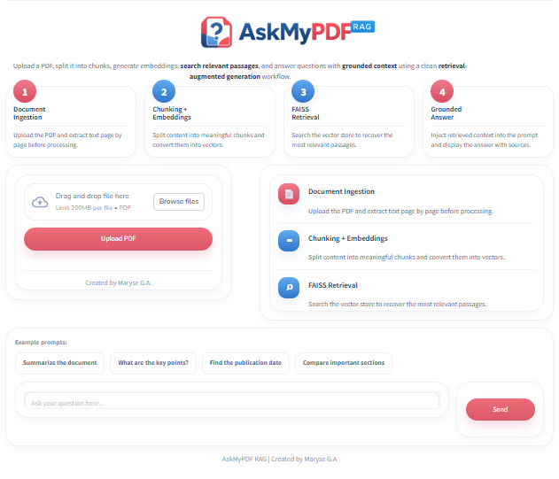

# askmypdf-rag

RAG application for question answering over PDF documents using embeddings, vector search, and LLM-based response generation.

Created by Maryse G.A.

<p align="center">
  
</p>

## Interface Preview



## Overview

AskMyPDF RAG is a portfolio-ready retrieval-augmented generation application that lets a user upload a PDF, build embeddings, index chunks in FAISS, retrieve relevant passages, and answer questions grounded in document context.

## What This Project Shows

This repository is intentionally structured to make the RAG workflow obvious:

- PDF ingestion
- Text extraction
- Chunking
- Embeddings
- FAISS vector store
- Retrieval
- Prompt with context
- Answer generation

## MVP Features

- Upload a PDF from the web interface
- Extract text page by page
- Split the document into chunks
- Create embeddings for each chunk
- Store embeddings in a FAISS vector store
- Ask questions about the PDF
- Retrieve the top-k most relevant chunks
- Generate an answer grounded in retrieved context
- Display the source chunks used for the answer

## Tech Stack

- Python
- Streamlit
- LangChain
- FAISS
- pypdf
- OpenAI-compatible API

## Project Structure

```text
askmypdf-rag/
|-- app.py
|-- requirements.txt
|-- .env.example
|-- README.md
`-- src/
    `-- askmypdf_rag/
        |-- config.py
        |-- pdf_ingestion.py
        `-- rag_pipeline.py
```

## RAG Pipeline

### 1. Ingestion

The user uploads a PDF in the Streamlit app. The application reads the file and extracts text page by page.

### 2. Chunking

The extracted text is split into overlapping chunks with `RecursiveCharacterTextSplitter` so retrieval stays precise while preserving context.

### 3. Embeddings

Each chunk is converted into a vector embedding with an OpenAI-compatible embeddings model.

### 4. Vector Store

The embeddings are indexed in FAISS for fast semantic similarity search.

### 5. Retrieval

When the user asks a question, the app runs similarity search and retrieves the top-k most relevant chunks.

### 6. Prompt With Context

The retrieved chunks are injected into a prompt template as explicit context for the LLM.

### 7. Answer Generation

The chat model generates an answer grounded in the retrieved context. The UI also shows the source chunks used.

## Setup

### 1. Create a virtual environment

```bash
python -m venv .venv
```

### 2. Activate it

Windows PowerShell:

```bash
.venv\Scripts\Activate.ps1
```

### 3. Install dependencies

```bash
pip install -r requirements.txt
```

### 4. Configure environment variables

Copy `.env.example` to `.env` and fill in your API credentials:

```env
OPENAI_API_KEY=your_api_key_here
OPENAI_BASE_URL=https://api.openai.com/v1
OPENAI_CHAT_MODEL=gpt-4.1-mini
OPENAI_EMBEDDING_MODEL=text-embedding-3-small
```

## Run The App

```bash
streamlit run app.py
```

## Example Resume / GitHub Summary

RAG application for question answering over PDF documents using embeddings, vector search, retrieval, and LLM-based response generation.

## Notes

- This MVP uses an in-memory FAISS index created from the uploaded PDF during the session.
- Scanned PDFs without extractable text will need OCR to work properly.
- For production, add persistence, OCR, evaluation, and citation scoring.
